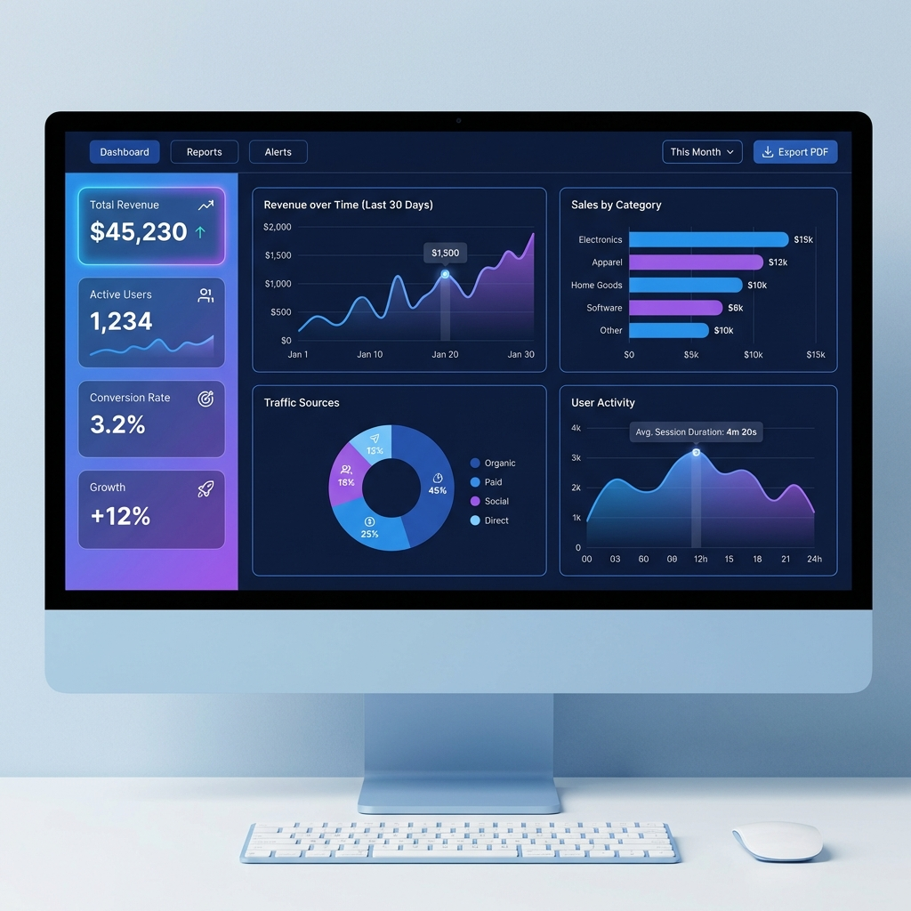
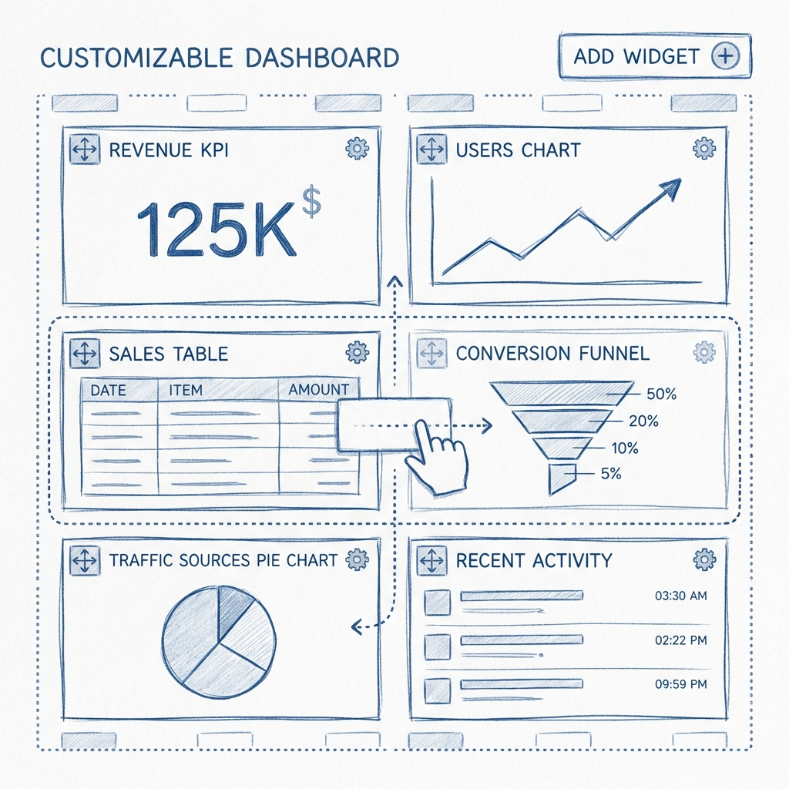
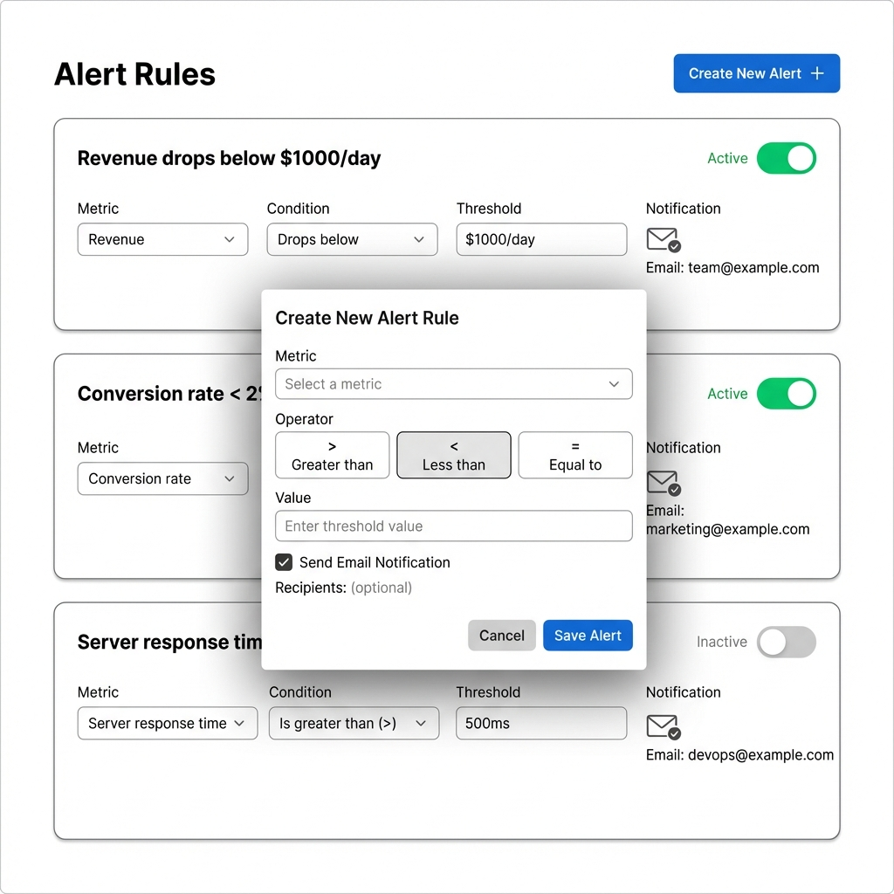
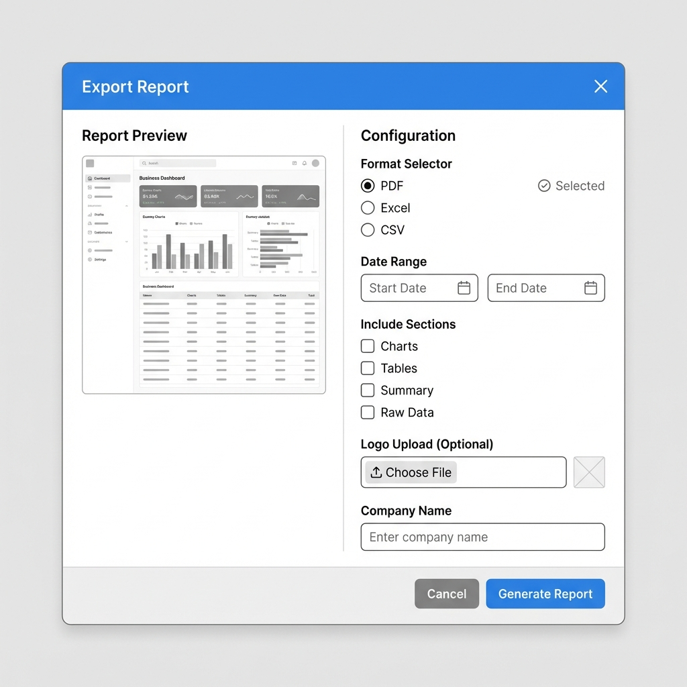

# Wireframes - MVP #4: Dashboard de Analytics / Business Intelligence

Visual mockups de los flujos principales de usuario.

---

## 1. Main Dashboard (Analytics Overview)



**Components**:
- **Top Navigation**: Logo, "Dashboard", "Reports", "Alerts" menu, user avatar
- **Left Sidebar - KPI Cards**:
  - "Total Revenue" ($45,230) with +12% trend indicator
  - "Active Users" (1,234) with trend line
  - "Conversion Rate" (3.2%) with target icon
  - "Growth" (+12%) with rocket icon
- **Main Content Area (2x2 Grid)**:
  - **Chart 1**: Line chart "Revenue over Time (Last 30 Days)" - Purple gradient area chart
  - **Chart 2**: Horizontal bar chart "Sales by Category" - Blue bars for Electronics, Apparel, Home Goods, Software, Other
  - **Chart 3**: Donut chart "Traffic Sources" - Organic (45%), Paid (25%), Social (20%), Direct (10%)
  - **Chart 4**: Area chart "User Activity" - Blue/purple gradient showing hourly activity
- **Top Right Controls**:
  - Date range dropdown ("This Month")
  - "Export PDF" button (blue)

**Key Features**:
- Color-coded KPIs with trend indicators
- Interactive charts with hover tooltips
- Responsive grid layout

---

## 2. Widget Customization (Drag & Drop)



**Layout Description**:
- **Page Title**: "Customize Dashboard"
- **Top Toolbar**:
  - "Add Widget" button (green, prominent, + icon)
  - "Save Layout" button (blue)
  - "Cancel" button (gray)
- **Main Area - Grid with Drag Handles**:
  - 6 widgets in customizable layout
  - Each widget has:
    - Drag handle icon (⋮⋮) in top-left
    - Title bar
    - Settings gear icon (top-right)
    - Delete X icon (top-right)
  - Widget examples:
    - Revenue KPI card (2x2)
    - Users line chart (4x3)
    - Sales table (6x4)
    - Conversion funnel (3x4)
    - Traffic pie chart (3x3)
    - Recent activity list (3x5)
  - Dotted lines showing drop zones when dragging
  - Grid indicators (12-column system)

**Interactions**:
- Click drag handle → widget becomes draggable
- Hover over drop zone → highlight blue border
- Drop widget → grid auto-adjusts
- Click "Add Widget" → modal opens with widget gallery

**Add Widget Modal**:
- Gallery of widget types: KPI Card, Line Chart, Bar Chart, Pie Chart, Table
- Each with preview thumbnail
- Click to select → Configure modal (select metric, customize title/colors)

---

## 3. Alerts Configuration



**Layout Description**:
- **Page Title**: "Alert Rules"
- **Subtitle**: "Get notified when metrics cross thresholds"
- **Top Right**: "Create New Alert" button (blue, + icon)

- **Alert List** (3 cards):
  
  **Card 1**: "Revenue drops below $1000/day"
  - Status toggle: ON (green)
  - Metric: Revenue
  - Condition: Less than (<)
  - Threshold: $1,000
  - Notification: 📧 Email to ceo@company.com
  - Last triggered: 2 days ago
  - Actions: Edit (pencil), Delete (trash)

  **Card 2**: "Conversion rate below 2%"
  - Status toggle: ON (green)
  - Metric: Conversion Rate
  - Condition: Less than (<)
  - Threshold: 2%
  - Notification: 📧 Email
  - Last triggered: Never
  - Actions: Edit, Delete

  **Card 3**: "Server response time > 500ms"
  - Status toggle: OFF (gray)
  - Metric: Response Time
  - Condition: Greater than (>)
  - Threshold: 500ms
  - Notification: 📧 Email
  - Last triggered: 1 week ago
  - Actions: Edit, Delete

**Create Alert Modal**:
- **Title**: "Create New Alert"
- **Form Fields**:
  - Alert Name (text input)
  - Metric (dropdown: Revenue, Users, Conversion Rate, etc.)
  - Condition (dropdown: Greater than, Less than, Equal to, % Change)
  - Threshold (number input with unit)
  - Email Notification (checkbox + email input)
- **Footer**: Cancel (gray) | Create Alert (blue)

**Features**:
- Toggle alerts on/off without deleting
- Color-coded status (green = active, gray = inactive)
- Last triggered timestamp
- Quick edit/delete actions

---

## 4. Export Report Modal



**Layout Description**:
- **Modal Title**: "Export Report

"
- **Modal Size**: Large (800px width)

**Left Side (40%)** - Preview:
- Miniature snapshot of dashboard
- Shows selected widgets highlighted
- Scrollable if many widgets

**Right Side (60%)** - Configuration:

**Section 1: Format**
- Radio buttons:
  - ● PDF (selected)
  - ○ Excel
  - ○ CSV

**Section 2: Date Range**
- Start Date: [Date picker] (Jan 1, 2024)
- End Date: [Date picker] (Jan 31, 2024)
- Quick options: Last 7 days, Last 30 days, This month

**Section 3: Include Sections**
- ☑ Charts
- ☑ Tables
- ☑ Summary Statistics
- ☐ Raw Data (CSV only)

**Section 4: Branding**
- Company Name: [Text input] "Acme Inc"
- Logo: [Upload area] "Drop file or click to upload" (Optional)
  - Recommended: PNG, 200x60px

**Footer**:
- Cancel button (gray)
- Generate Report button (blue, large)

**Post-Generation**:
- Progress indicator: "Generating report... 45%"
- Success: "Report ready! Downloading..."
- Auto-download PDF
- Option: "Send via email" checkbox

---

## Key User Flows

### Flow 1: Create Dashboard
```
Login → Dashboard → Add Widget → Select Metric → Configure → Save → View
```

### Flow 2: Setup Alert
```
Alerts → Create Alert → Select Metric + Condition → Enter Threshold → Save → Email sent when triggered
```

### Flow 3: Export Report
```
Dashboard → Export PDF → Select Widgets → Configure → Generate → Download
```

---

## Responsive Behavior

### Desktop (>1024px):
- Full 12-column grid
- Sidebar with KPIs visible
- Charts side-by-side

### Tablet (768-1024px):
- 6-column grid
- Widgets stack more vertically
- Sidebar collapses to hamburger

### Mobile (<768px):
- Single column
- Widgets full-width
- Charts scroll horizontally

---

## Accessibility Notes

- All charts have ARIA labels
- Keyboard navigation for drag-and-drop (arrow keys)
- High contrast mode support
- Screen reader announces metric values
- Focus indicators on all interactive elements

---

## Design System References

- **Colors**: 
  - Primary: Blue (#3b82f6)
  - Secondary: Purple (#8b5cf6)
  - Success: Green (#10b981)
  - Warning: Yellow (#f59e0b)
  - Danger: Red (#ef4444)
- **Typography**: Inter (UI), Poppins (headings)
- **Charts**: Recharts library
- **Icons**: Lucide React

---

## Notes for Implementation

### Chart Libraries
- **Recharts** (recommended): React-native, customizable, responsive
- Alternative: Chart.js (canvas-based, faster for large datasets)

### Drag & Drop
- Use `react-beautiful-dnd` or `dnd-kit`
- Grid system: 12 columns (like Bootstrap)
- Snap to grid on drop

### PDF Export
- Server-side rendering with Puppeteer
- Or client-side with jsPDF + html2canvas
- Store PDFs in Supabase Storage (7-day expiry)

---

**Last Updated**: 2026-01-13  
**MVP**: #4 - Dashboard de Analytics / Business Intelligence  
**Images**: 4/4 generated ✅
